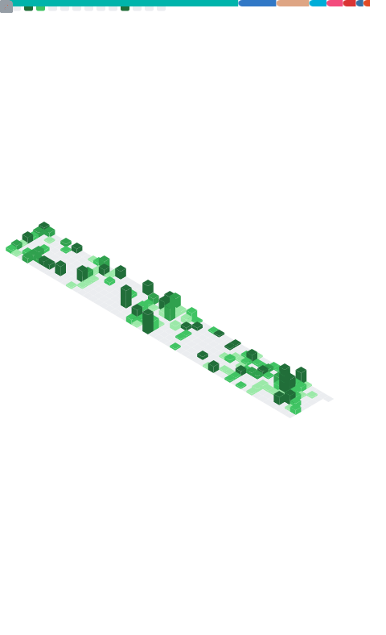
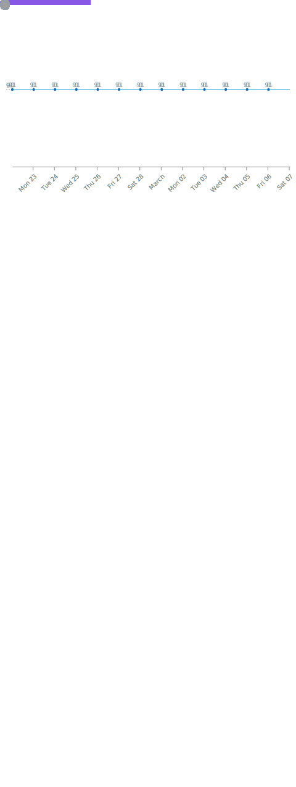

<h2 align="center">Raed Addala</h2>

<blockquote align="center">
  <em>"Make it work, then make it beautiful, then if you really, really have to, make it fast."</em><br>
  - Joe Armstrong, <em>Erlang and OTP in Action</em>
</blockquote>

<br>

<p align="center">
  
  &nbsp;
  
  &nbsp;
  
</p>

<h2 align="center">🌐 Connect with Me</h2>

<p align="center">
  <span style="display: inline-flex; gap: 20px; align-items: center; justify-content: center;">
    <a href="https://linkedin.com/in/raed-addala-498b69191" target="_blank">
      
    </a>
    <a href="https://codeforces.com/profile/MekraziRaed" target="_blank">
      
    </a>
    <a href="https://stackoverflow.com/users/11842805/raed-addala" target="_blank">
      
    </a>
    <a href="https://www.kaggle.com/raedaddala" target="_blank">
      
    </a>
  </span>
</p>

<h2 align="center">📊 GitHub Metrics</h2>

<p align="center">
  
</p>

<!-- <p align="center">
  
</p>

<p align="center">
  
</p> -->

<!--
```
███████████████████████████████████████████  ██╗  ██╗███████╗██╗     ██╗      ██████╗
███████████████████████████████████████████  ██║  ██║██╔════╝██║     ██║     ██╔═══██╗
██████████████████`.        ╙██████████████  ███████║█████╗  ██║     ██║     ██║   ██║
███████████████▀  ¿▓▓▓▓▓▓▓▓▄/ "████████████  ██╔══██║██╔══╝  ██║     ██║     ██║   ██║
█████████████▀.  ▓▓▓▓▓▓▓▓▓▓▓▓   ▐██████████  ██║  ██║███████╗███████╗███████╗╚██████╔╝▄█╗
█████████████ `  ▓▓▓▓▓▓▓▓▓▓▓▓  ` ██████████  ╚═╝  ╚═╝╚══════╝╚══════╝╚══════╝ ╚═════╝ ╚═╝
█████████████ `  ▓▓▓▓▓▓▓▓▓▓▓▓   ▄██████████
██████████████▌  ▀▀▓▓▓▓▓▓▓▌╓╖. ████████████  ███╗   ██╗██╗ ██████╗███████╗  ████████╗ ██████╗
████████████████▄ ╩╦╙▀▀▀▀▀ ╣`,█████████████  ████╗  ██║██║██╔════╝██╔════╝  ╚══██╔══╝██╔═══██╗
█████████▀▀▀▀█████▄▄ .... ,▄███████▀███████  ██╔██╗ ██║██║██║     █████╗       ██║   ██║   ██║
███████▀  ╪╢%╦══~╓,└ ╚▒▒▒ ╙▀|,╓╓═╤H   ▀████  ██║╚██╗██║██║██║     ██╔══╝       ██║   ██║   ██║
██████   ║▒▒▒▒▒▒▒▒▒▒╢╦ ╘ -╣▒▒▒▒▒▒▒▒▒╢╕   ▀█  ██║ ╚████║██║╚██████╗███████╗     ██║   ╚██████╔╝
██████▄          ═╕╕╕╕╕═╕═══════       ▄▄▄▄  ╚═╝  ╚═══╝╚═╝ ╚═════╝╚══════╝     ╚═╝    ╚═════╝
█████▌         ╕   ╩▒▒▒▒▒▒▒▒▒Ñ          ███
███████`╔▒▒╣ █ ▒▒m   ╚▒╢▒▒▒╩ -╣▒ ▌ ▒▒▒ ████  ███╗   ███╗███████╗███████╗████████╗  ██╗   ██╗ ██████╗ ██╗   ██╗
██████╜ ▒▒▒ ▄█ Ñ   -   S.  ═▒▒▒▒ █ ║▒▒╕└███  ████╗ ████║██╔════╝██╔════╝╚══██╔══╝  ╚██╗ ██╔╝██╔═══██╗██║   ██║
╤╣"╣╩═     ╒██   ═╣▒▒ `Ñ╛        █▌ ▒▒▒ ███  ██╔████╔██║█████╗  █████╗     ██║      ╚████╔╝ ██║   ██║██║   ██║
╤╣▒╣╩═",▄▄████  ▒▒╣"     ''''''' ▀▀     `██  ██║╚██╔╝██║██╔══╝  ██╔══╝     ██║       ╚██╔╝  ██║   ██║██║   ██║
█████████████         ---------    L'▒▒▒ ██  ██║ ╚═╝ ██║███████╗███████╗   ██║        ██║   ╚██████╔╝╚██████╔╝
▀▀▀▀▀▀▀▀▀▀▀▀▀      '╧╧╧╧╧╧╧╧╧`     ╚ ╧╧╧- ▀  ╚═╝     ╚═╝╚══════╝╚══════╝   ╚═╝        ╚═╝    ╚═════╝  ╚═════╝
```
-->
